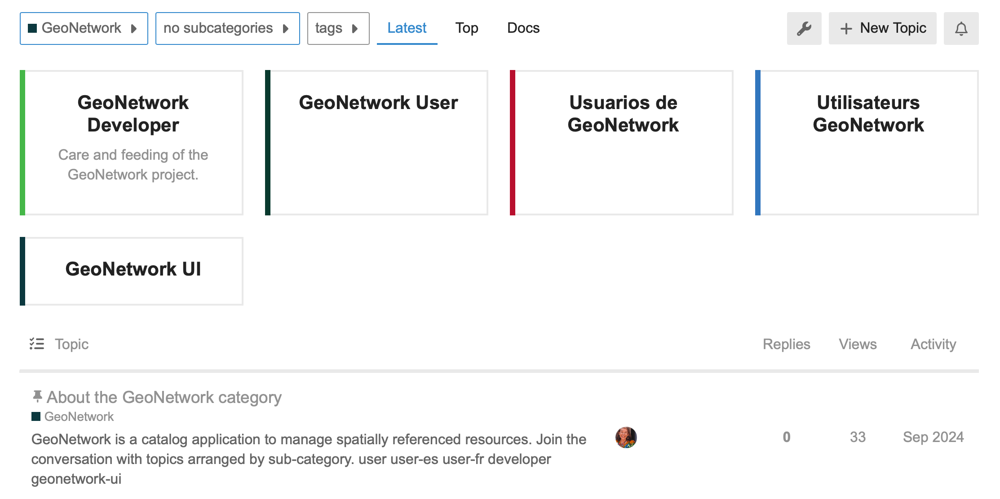

.. _community:

Community
=========

Welcome to the GeoNetwork community:

1. Public communication: To ask a question, explore a new idea, or troubleshoot a problem please
   make use of our public communication channels:
   
   * `GeoNetwork Forum <https://discourse.osgeo.org/c/geonetwork/55/none>`_
   * `Gitter Chat <http://irclogs.geoapt.com/geonetwork/>`__
   * `GIS StackExchange <https://gis.stackexchange.com/questions/tagged/geonetwork>`_
   
2. Issue tracker: When troubleshooting has found an issue to resolve, or discussion highlighted a new feature to explore, it is recorded in the issue tracker.
   
   * `core-geonework issues <https://github.com/geonetwork/core-geonetwork/issues>`__
   
3. Development: New features and fixes are provided to the codebase as pull-requests.
   
   * `core geonetwork pull requests <https://github.com/geonetwork/core-geonetwork/pulls>`__
   
   See project `contributing policy <https://github.com/geonetwork/core-geonetwork/blob/main/CONTRIBUTING.md>`__ for information on how to participate. 

Keep in mind:

* These communication channels are public and intended to be both positive and welcoming.
  See `Contributor Covenant Code of Conduct <https://github.com/geonetwork/core-geonetwork/blob/main/CODE_OF_CONDUCT.md>`__ pledge for details. 

* We understand that not everyone is in a position to communicate publicly.
  For private support please contact a `GeonNetwork service providers <https://www.osgeo.org/service-providers/?p=geonetwork>`__.

* Security issues should not be discussed in public.
  Please see `security policy <https://github.com/geonetwork/core-geonetwork/security/policy>`__ for
  information on how security is handled along with a list of published advisories.

* Larger changes are written up as a `roadmap proposal <https://github.com/orgs/geonetwork/projects/2>`__ with
  opportunities seeking fundings, and proposals in position to be reviewed and scheduled by the `leadership team <https://docs.geonetwork-opensource.org/latest/overview/authors/>`__.

User forum
----------

    
Join discussion on `OSGeo Discourse <https://discourse.osgeo.org/c/geonetwork/55/none>`_.

The forum has GeoNetwork User categories for `English <https://discourse.osgeo.org/c/geonetwork/user/54>`_, `Spanish <https://discourse.osgeo.org/c/geonetwork/user-es/56>`_, and `French <https://discourse.osgeo.org/c/geonetwork/user-fr/57>`_ discussion. 

There is a category for the `geonetwork-ui project <https://discourse.osgeo.org/c/geonetwork/user-fr/57>`_.

For programmers there is a category `GeoNetwork Developer <https://discourse.osgeo.org/c/geonetwork/user-fr/58>`_  discussion.

Each category has an introduction describing how to sign in, post a topic, or configure for use as a mailing list.

Gitter
------

GeoNetwork has a gitter channel https://gitter.im/geonetwork/core-geonetwork that you can join.

Chat can be very useful for one-on-one collaboration, however due to timezone differences it is not always efficient for asking questions.

This channel replaces the previous IRC. For a history of previous activity on the IRC channel, search the `archives
<http://irclogs.geoapt.com/geonetwork/>`_.

StackExchange
-------------

`GIS StackExchange <https://gis.stackexchange.com/questions/tagged/geonetwork>`_ ask for GeoNetwork support using the ``geonetwork`` tag.

* List of recent questions: https://gis.stackexchange.com/questions/tagged/geonetwork
* List of unanswered questions: https://gis.stackexchange.com/questions/tagged/geonetwork?sort=unanswered

Questions that help discover bugs should lead to the creation of bug reports in the GitHub issue tracker.

GitHub
------

The `GeoNetwork GitHub issues tracker <https://github.com/geonetwork/core-geonetwork/issues>`_ with templates for both **bug reports** and **feature requests**. The provided templates *need to be followed* in order to facilitate
reproduction (for bugs) or assessment (for features).

When creating an issue you expected to be actively engaged: ensuring it is complete, answering questions, providing additional information, and suggesting fixes.

If an issue is really important to you, please help us look for funding to work on it.

Issues with no activity in the last 6 months will be automatically closed.