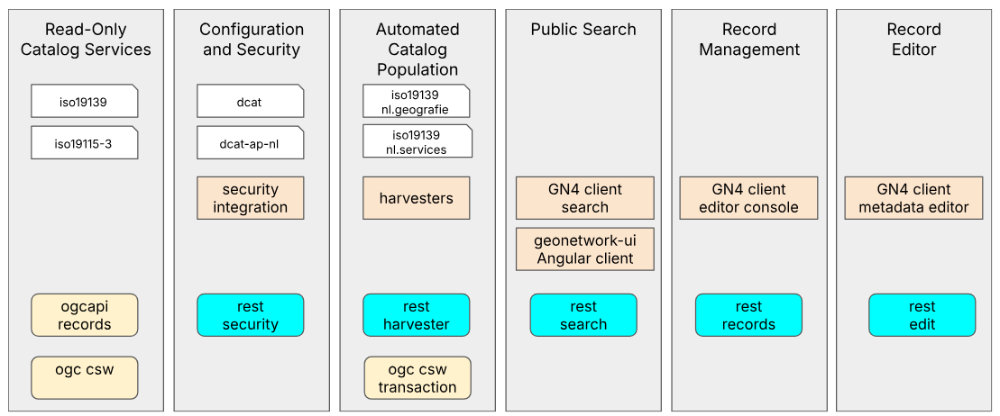

.. _crowdfunding:

GeoNetwork 5 Crowdfunding
=========================

GeoNetwork is the most popular and loved open-source catalog, trusted by organizations to deliver on their geospatial data management objectives. GeoNetwork is used by 80-90% of European Union countries’ formal endpoints to the INSPIRE GeoPortal.

As the digital landscape evolves, staying up-to-date with the latest technologies is no longer optional - it is essential. GeoNetwork 5 development is our current effort to address critical challenges identified by the GeoNetwork community to ensure GeoNetwork remains a reliable and secure platform for the future: 

* **Regulatory Compliance:** New legislation requires systems be fully patched for operational readiness. Without the latest updates, GeoNetwork risks falling short of these standards, which is why migrating to Spring Boot 6 is essential.

* **End of Support for Spring 5:** Spring 5 is no longer receiving security updates, leaving GeoNetwork vulnerable. Any serious security vulnerability will need to be mitigated, rather than addressed with a patched update.

* **Security Enhancements:** By moving to Spring Security 6, GeoNetwork 5 gains advanced authentication and authorization capabilities suited for both enterprise deployments and emerging Data Spaces architectures, keeping pace with evolving security standards and safeguarding sensitive geospatial records.

* **Switching to JDK 17:** This update marks the transition to Java 17 LTS providing improvements in performance, security, and long-term support.

* **Multi-App Scalability:** The multi-app architecture of GeoNetwork 5 enables deploying separate services so each component can be scaled independently, ensuring optimal resource utilization and performance.

* **Improved XML Engine:** GeoNetwork 5 transitions from 2008 era Saxon XML Engine to the latest SaxonHE release providing a migration path for metadata schemas, starting with ISO19139, ISO19115 and DCAT-AP support.

* **OGC API Records:** Right from the outset, the GeoNetwork 5 API includes endpoints that comply with the latest OGC API Records Part 1 specification, and we will continue to track and incorporate future parts as development advances.

* **Future Proof Technology Stack:** With migration to Java 17 and transition to Spring Boot 6 GeoNework maintains our commitment to a sustainable open source project.

GeoNetwork 5 is a major upgrade, led by GeoCat, to address these challenges head on. GeoNetwork 5 proof-of-concept is already up and running, we are excited about the direction of the project. We take this opportunity to ask for your support and funding.

In comparison to the GeoServer 3 Crowdfunding Campaign, which is structured as an all-or-nothing activity, GeoNetwork 5 Crowdfunding is set up as a series of progressive milestones to be funded in turn:

- Staged milestone approach allows the development team to start earlier, and deliver useful functionality more often.

- At each stage sponsors are provided with a working GeoNetwork 5 App, built with the latest frameworks, that can be deployed in a public facing capacity.

- During the transition a private GeoNetwork 4 operational environment is used to manage records for the public facing GeoNetwork 5 system.

- The final deliverable is a standalone GeoNetwork 5 App offering a drop-in replacement for your existing GeoNetwork 4 deployment.

GeoNetwork 5 target is an ambitious €800,000. GeoCat is funding initial development and has secured support for several early milestones and development targets. This means the current funding goal is €500,000 spread project milestones.

* Organizations are asked to support the project financially. GeoNetwork 5 is a major undertaking structured as a crowdfunding activity to secure funding across organizations due to the level of effort required.

* We are seeking organizations to complete funding for milestones already in progress, and pledge their support for future milestones allowing the project to be effectively managed. Please contact `Jeroen Ticheler <mailto:jeroen.ticheler@geocat.net>`_ to express your interest and support for GeoNetwork 5.

* Developers and Organizations in position to pledge time to `GeoNetwork 5 activities <https://github.com/orgs/geonetwork/projects/4>`_ are asked to coordinate with the team. The GeoNetwork project is up and running, check-in with the `GeoNetwork developer forum <https://discourse.osgeo.org/c/geonetwork/55/none>`_ or join the bi-weekly `GeoNetwork 5 meetings <https://discourse.osgeo.org/t/meetings-for-geonetwork-5/146312/21>`_.

Thank you, together we can secure the future of GeoNetwork for years to come.

FAQ
^^^

**Q: Why not a kickstarter or go-fund-me?**

GeoNetwork tends to be used by organizations rather than individuals.

Individuals are encouraged to donate as outlined in GeoNetwork 2025 Sponsorship Opportunities or by direct participation in the GeoNetwork 5 project.

**Q: What work needs to be done?**

The GeoNetwork 5 project board describes the activities currently underway.

    **GeoNetwork 5 milestones:**

    **Milestone 1:** Read-Only Catalog Services
    Modern Spring Boot App providing OGC Catalog Services (CSW) and the latest OGCAPI - Records service. Provides public facing web services, using operational ready technologies.

    **Milestone 2:** Configuration & Security
    Allows content to be restricted to specific users and groups. 

    **Milestone 3:** Automated Catalog Population
    Ability Harvest information and update records allows GeoNetwork 5 App to operate independently using its own database and ElasticSearch index.

    **Milestone 4:** Public Search
    Provides a public facing GeoNetwork 5 catalog.

    **Milestone 5:** Record Management
    Support of record review and publication.

    **Milestone 6:** Record Editing
    Support of record validation and editing.

To help out please engage with `project community <community.html>`_ and take part in the bi-weekly GeoNetwork 5 meeting organized on the developer forum. 

**Q: What technologies need to be updated?**

The following updates are required to migrate to a Spring Boot 6 environment. A critical update is the Saxon XML engine where we are using a patched version from 2008. Changing the XML engine requires careful migrating first ISO19139 and then each national schema in turn.

\* Spring Framework 5.3 reached EOL in August 2024.
\*\* 2008 release Saxon no longer supported, we maintain a patched version.

**Q: My organization procurement cannot respond to a crowdfunding campaign; can we fund a specific activity?**

Yes, we have the flexibility to invoice against a specific activity or deliverable outlined in the project milestones.

Deliverables are not independent and are accomplished within the context of an individual milestone. In many cases work is planned that builds on the preceding stage, so we ask you to prioritize funding current development, or ask if it is possible to bring work forward.

We will be sure to recognize your sponsorship alongside the functionality in presentations and blog posts.

**Q: Can my developers work in-kind on GeoNetwork 5?**

Yes of course, the GeoNetwork 5 proposal is public, with bi-weekly meetings organized on the GeoNetwork Developer Forum.

If you are in position to devote in-kind resources to the project, and be scheduled alongside the GeoNetwork 5 project team, please contact us to offer your assistance and be recognized as a supporting organization.

**Q: Will a specific metadata101 schema be included?**

Check the project plan for a list of schemas required to meet our objectives.

The transition from Saxon to SaxonHE requires that each schema be ported over to the GeoNetwork 5 environment. We also wish to improve the quality assurance support for schema authors to prevent the need for manual testing of each pull-request.

With this in mind the foundational schemas such as ISO19139 or ISO19115-3 needed to be ported first, and then the various national formats, and output formats, can subsequently be migrated one by one.

**Q: What about AngularJS client?**

The AngularJS framework has reached end-of-life December 2021, and the gn4-ui is no longer on a supported platform:
Providing a legacy-free GeoNetwork client experience is being pursued independent of this GeoNetwork 5 project which focuses on the back-end infrastructure.
GeoNetwork 5 will be tested with both the GN4 AngularJS client, and the geonetwork-ui Angular client
We have also been impressed with OGCAPI - Records and clients written directly against OGC API services.

If you are interested in Angular Client development, or wish to engage with GeoCat for commercial support of gn4-ui client, please contact Jeroen Ticheler to discuss options.
 
**Q: Why is DCAT development limited to GeoNetwork 5?**

The XML Engine is different between GeoNetwork 4 (Saxon) and GeoNetwork 5 (SaxonHE) , preventing the direct use of xml schemas and transformation required for DCAT development.

The GeoNetwork 5 development environment offers a light weight, faster environment, for new development. 

**Q: If you are using Spring Boot, is a cloud-native GeoNetwork planned?**

The technology decisions made for GeoNetwork lay the groundwork for independent GeoNetwork services.

This ability is shown in the initial GeoNetwork 5 / GeoNetwork 4 development environment, and is something we wish to explore in the future.