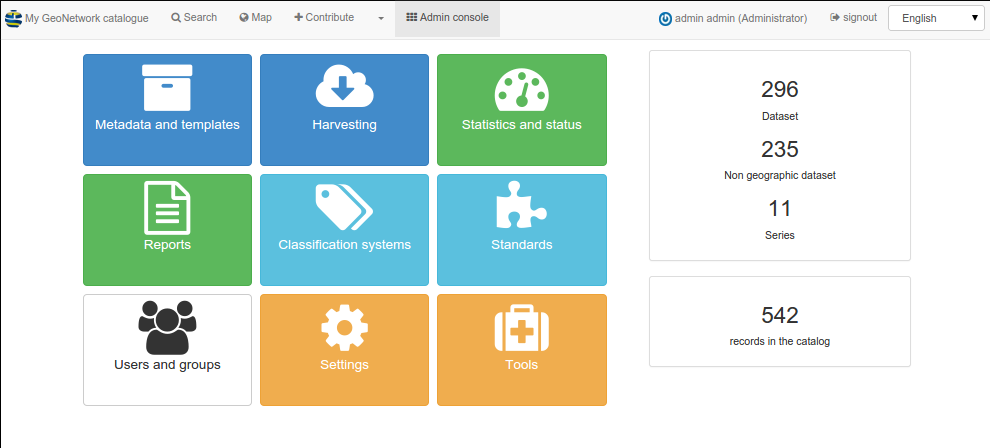

.. _gallery:

Gallery
=======

GeoNetwork screenshots
----------------------

.. image:: ../gn3-search.png
    :width: 600 px
    :alt: GeoNetwork v3 Search results

.. image:: ../gn3-map.png
    :width: 600 px
    :alt: Map viewer

.. image:: ../gn3-new.png
     :width: 600 px
     :alt: Create a new record

.. image:: ../gn3-edit.png
     :width: 600 px
     :alt: Editing record

Data portal screenshots
-----------------------

Dutch National Georegistry
^^^^^^^^^^^^^^^^^^^^^^^^^^

.. image:: dutch_national_georegistry.png

http://www.nationaalgeoregister.nl

SwissTopo geocat.ch
^^^^^^^^^^^^^^^^^^^

.. image:: geocat.ch.png

http://www.geocat.ch

GeoNetwork nodes
----------------

List of known GeoNetwork opensource based catalogues. Send us an email if you want your node to be listed here.

.. csv-table::
     :widths: 10, 20, 20, 50
     :header-rows: 1
     :file: list.csv

