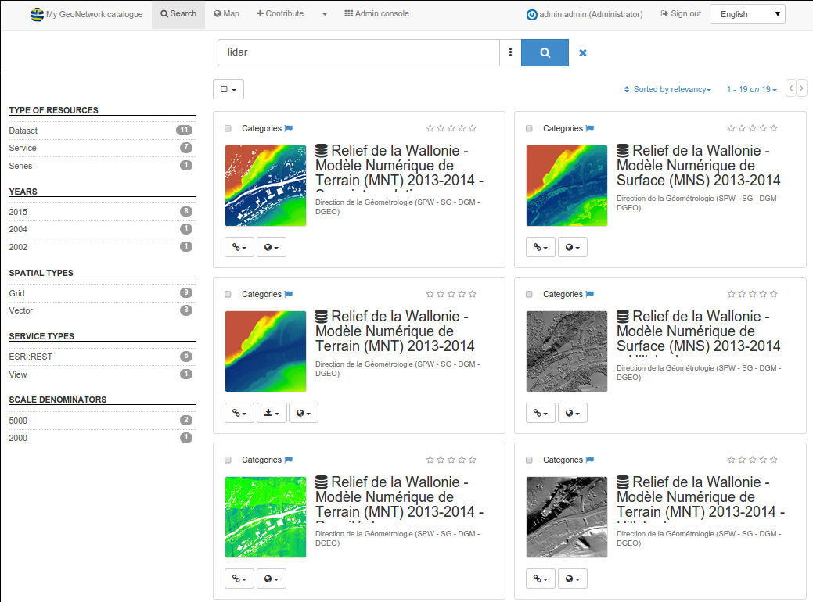
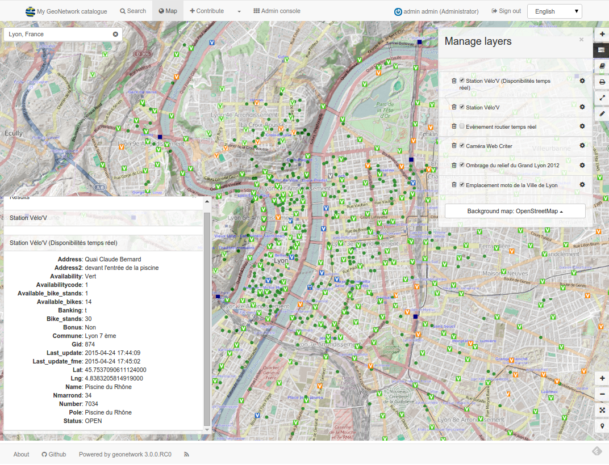
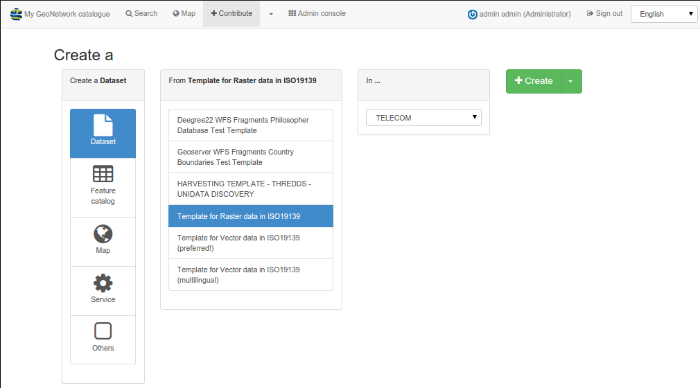
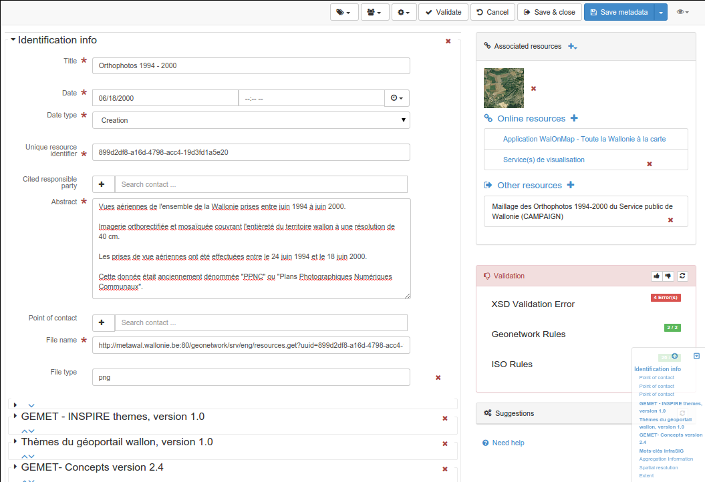

.. _gallery:

Gallery
=======

Data portals using GeoNetwork
-----------------------------

The product documentation contains a list of portals which are based on GeoNetwork. 

The list is available at https://docs.geonetwork-opensource.org/latest/annexes/gallery/

GeoNetwork screenshots
----------------------

This paragraph lists a visual representation of some of the main functionalities of GeoNetwork.

Search
^^^^^^

Find & Get information

Map Viewer
^^^^^^^^^^

Make your maps

New record
^^^^^^^^^^

Create a new record

The Editor
^^^^^^^^^^

Publish and describe resources

