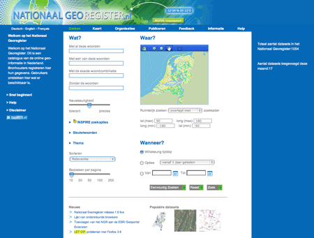
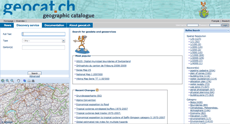

.. _gallery:

Gallery
=======

GeoNetwork screenshots
----------------------
Géoportail du Labex CEBA Centre d’étude de la biodiversité amazonienne

.. image:: vmcebagn-dev.ird.fr.png

http://vmcebagn-dev.ird.fr

Dutch National Georegistry
^^^^^^^^^^^^^^^^^^^^^^^^^^

http://www.nationaalgeoregister.nl

SwissTopo geocat.ch
^^^^^^^^^^^^^^^^^^^

http://www.geocat.ch

GeoNetwork nodes
----------------

List of known GeoNetwork opensource based catalogues. Send us an email if you want your node to be listed here.

.. list-table:: GeoNetwork nodes
   :widths: 15 85
   :header-rows: 1

   * - Logo
     - Description
   * - .. Image:: http://www.fao.org/geonetwork/images/logos/fao.gif
     - FAO GeoNetwork - http://www.fao.org/geonetwork
         Food and Agriculture Organization of the United Nations GeoNetwork
   * - 
     - WFP VAM-SIE Headquarters - http://vam.wfp.org/geonetwork
         United Nations World Food Programme GeoNetwork
   * - .. Image:: http://www.fao.org/geonetwork/images/logos/unep.gif
     - UNEP Headquarters - http://www.ecomundus.net
         ecoMundus - Network for Environmental Information and Data
   * - 
     - WHO Headquarters - http://www.who.int/geonetwork
         World Health Organization GIS Resources
   * - .. Image:: http://www.csi.cgiar.org/images/logo/cgiar_gn_small_tran.gif
     - CGIAR-CSI Main GeoNetwork Node - http://geonetwork.csi.cgiar.org
         CGIAR-CSI - Consortium for Spatial Information - Main node
   * - .. image:: geoportal.png
     - GEOSS GEOportal - http://www.geoportal.org
         The GEOportal provides an entry point to access Earth Observation information and services. 
         Developed by ESA and FAO. GEOportal uses GeoNetwork for the catalog. InterMap is used as map viewer.
   * - .. Image:: http://www.geodata.govt.nz/themes/nzgo/images/nzgovtLogo.gif
     - New Zealand's Geodata.govt.nz - http://www.geodata.govt.nz
        New Zealand's catalogue of publicly-funded geospatial data
   * - .. Image:: http://www.gis.napier.govt.nz/geonetwork/images/logos/17689d3f-5a49-487e-93b7-d8c2f76c543d.gif
     - Napier City Council GeoNetwork - http://www.gis.napier.govt.nz/geonetwork
         Napier City Council - New Zealand
   * - .. Image:: http://www.nationaalgeoregister.nl/geonetwork/images/logos/geonovum.jpg
     - Dutch National Geo Registry -  http://www.nationaalgeoregister.nl
         Nationaal Geo Register - The Netherlands
   * - .. Image:: http://geonetwork.impetus.uni-koeln.de/images/logos/9952eed6-578b-4d71-bf23-ee97db0a7ec4.gif
     - Impetus GeoNetwork - http://geonetwork.impetus.uni-koeln.de
         An interdisciplinary research project from Germany (University of Cologne and Bonn
   * - .. Image:: http://geoportal.kscnet.ru/geonetwork/images/logos/132dbfeb-6b76-4828-b1ca-3966d2ee250a.gif
     - IVS FEB RAS GeoNetwork - http://geoportal.kscnet.ru/geonetwork/
         Institute of Volcanology and Seismology of FEB RAS, Russia
   * - 
     - Brasil IBGE GeoNetwork - http://www.metadados.geo.ibge.gov.br/
         IBGE - Instituto Brasileiro de Geografia e Estatstica (Brazilian Institute of Geography and Statistics)
   * - 
     - Brasil INDE - http://www.metadados.inde.gov.br/
        Metadata catalog of INDE (National Infrastructure of Spatial Data)
   * - .. Image:: http://mapas.mma.gov.br/geonetwork/images/logos/geonetwork-mma.gif
     - MMA - http://mapas.mma.gov.br/geonetwork/
         Ministerio do Meio Ambiente, Brasil Geo processamento
   * - 
     - SADC - http://www.sadc.int/geonetwork
         Southern African Development Community
   * - 
     - SANDRE - http://sandre.eaufrance.fr/geonetwork
         Le Service d'Administration Nationale des Données et Référentiels sur l'Eau
   * - 
     - SOPAC - Pacific Islands Applied Geoscience Commision - http://geonetwork.sopac.org
         SOPAC GeoNetwork for Oceanographic data and information
   * - .. Image:: http://www.unsdi.nl/images/UNSDI-NL-64x64.gif 
     - UNSDI-NCO - http://www.geonetwork.nl/
         GeoNetwork portal of the Netherlands Coordination Office of UNSDI
   * - 
     - PBL - Netherlands Environmental Assessment Agency - http://geoservice.pbl.nl/geonetwork/srv/en/main.home
         Geo-products of the Netherlands Environmental Assessment Agency
   * - 
     - UNGIWG - SALB - http://salbgeonetwork.grid.unep.ch/geonetwork/srv/en/main.home
         Second Administrative Level Boundaries
   * - 
     - AfroMaison - http://afromaison.grid.unep.ch:8080/geonetwork/ 
         UNEP-GRID's EU Framework Programme AfroMaison portal
   * - 
     - geoNorge - http://www.geonorge.no/geonetwork/srv/en/main.home 
         Norge digitalt
   * - 
     - WODGIK - Katowice - http://www.wodgik.katowice.pl:8080/geonetwork/srv/en/main.home 
         Portal Katalogowy
   * - 
     - FEB RAS - http://geoportal.kscnet.ru/geonetwork/srv/en/main.home 
         Institute of Volcanology and Seismology 
   * - 
     - IDE - http://138.100.63.169:8082/geonetwork/srv/es/main.home
		     Comunidades Rurales del Milenio Universidad Politecnica de Madrid 
   * - 
     - AIMS - http://data.aims.gov.au/geonetwork/srv/en/main.home
		     Australian Institute of Marine Science
   * - 
     - AODN - http://waodn.ivec.org/geonetwork/srv/en/main.home
	       Australian Ocean Data Network
   * - 
     - CSIRO - http://mdu-data.arrc.csiro.au/geonetwork/srv/en/main.home
	       Minerals Down Under
   * - 
     - Integrated Marine Observing System - http://imosmest.aodn.org.au/geonetwork/srv/en/main.home
   * - 
     - WAGCOE - https://wagcoe.ivec.org/geonetwork/srv/en/main.home
   * - 
     - PACIVUR - http://www.pacivur-geocatalogo.ird.fr/geonetwork/srv/en/main.home
   * - 
     - INDE - http://www.metadados.inde.gov.br/geonetwork/srv/en/main.home
	       Infraestrutura Nacional de Dados Espaciais
   * - 
     - IGM Geoportal - http://www.geoportaligm.gob.ec/geonetwork/srv/en/main.home
   * - 
     - SMIT - CENAPRED - http://smit.cenapred.gob.mx:8080/geonetwork/srv/en/main.home
   * - 
     - GEO/IDEP - http://www.geoportaligm.gob.ec/geonetwork/srv/en/main.home
   * - 
     - CARPE - http://congo.iluci.org:8080/geonetwork/srv/en/main.home
	       Central Africa Regional Program for the Environment
   * - 
     - NCCH - http://www.saeonocean.co.za/geonetwork/srv/en/main.home
	       South Africa portal
   * - 
     - South African Environmental Observation Network - http://www.saeonocean.co.za/geonetwork/srv/en/main.home
   * - 
     - Volta Basin Authority - http://131.220.109.2/geonetwork/srv/en/main.home
   * - 
     - Pusat linkungan geologi - http://122.200.145.136/geonetwork/srv/en/main.home
   * - 
     - TABI - http://www.tabi.la/geonetwork/srv/en/main.home
	       The Agrobiodiversity Initiative 
   * - 
     - ISRIC - http://85.214.194.220/geonetwork/srv/en/main.home
	       World Soil Information
   * - 
     - North Pacific Marine Science Organization - http://67.212.128.197/geonetwork/srv/en/main.home
   * - 
     - One Geology - http://onegeology-catalog.brgm.fr/geonetwork/srv/en/main.home
   * - .. Image:: http://www.csi.cgiar.org/images/logo/ciat_logo_verysmall.gif
     - CIAT GeoNetwork Node - http://gisweb.ciat.cgiar.org:8080/geonetwork/srv/en/main.home
         CGIAR-CSI - Consortium for Spatial Information Centro CIAT - Internacional de Agricultura Tropical
   * - .. Image:: http://www.csi.cgiar.org/images/logo/iwmi_logo_verysmall_trans.gif
     - IWMI GeoNetwork Node - http://geonetwork.iwmi.org
   * - 
     - ICRISAT GeoNetwork Node - http://geonetwork.icrisat.org
   * - .. Image:: http://geonet.icarda.cgiar.org/geonetwork/images/logos/my-org.gif
     - ICARDA GeoNetwork Node - http://geonet.icarda.cgiar.org/geonetwork
   * - .. Image:: http://www.csi.cgiar.org/images/logo/cpwf_logo_verysmall_trans.gif
     - CPWP Project GeoNetwork Node - http://geonetwork.waterandfood.org/
   * - .. Image:: http://www.webservice-energy.org/sites/www.webservice-energy.org/files/webservice-icon-texte-128.gif
     - Webservice-Energy Catalog provides worldwide information about Renewable Energy and Environment.
       It is developed by the Center Observation, Impacts, Energy (O.I.E.) of MINES ParisTech / ARMINES and supported by several international initiatives, various institutions, research project, SME's and learned societies. - http://geocatalog.webservice-energy.org/
     

