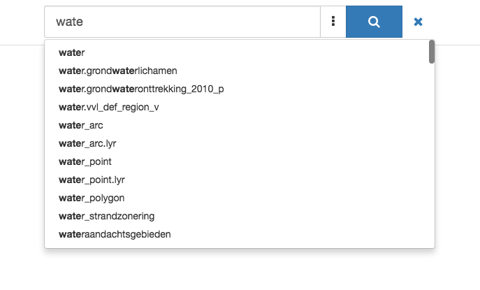
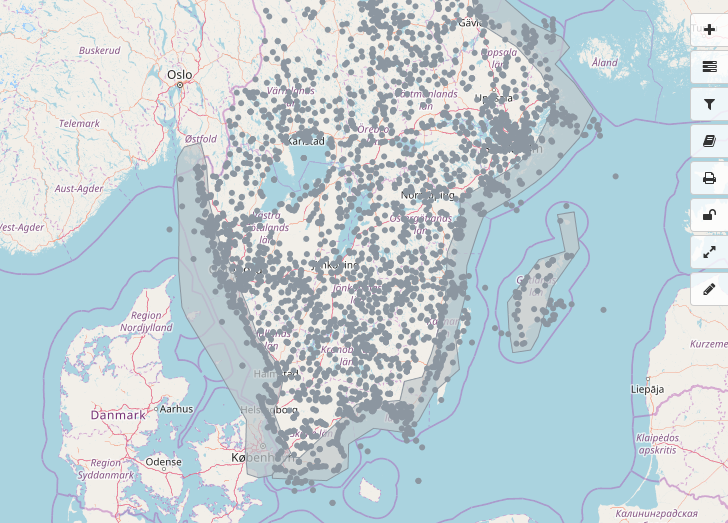
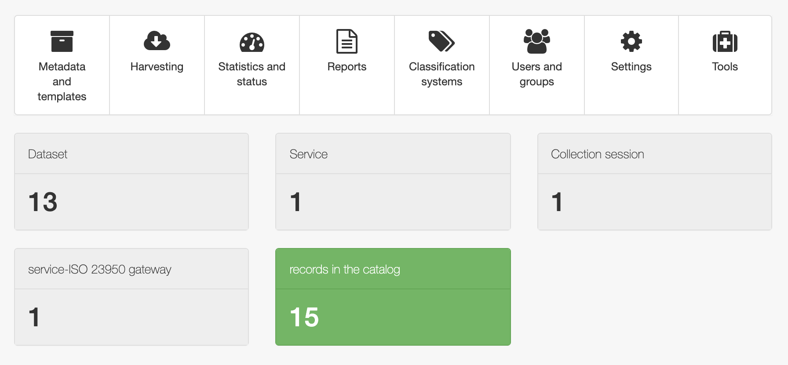
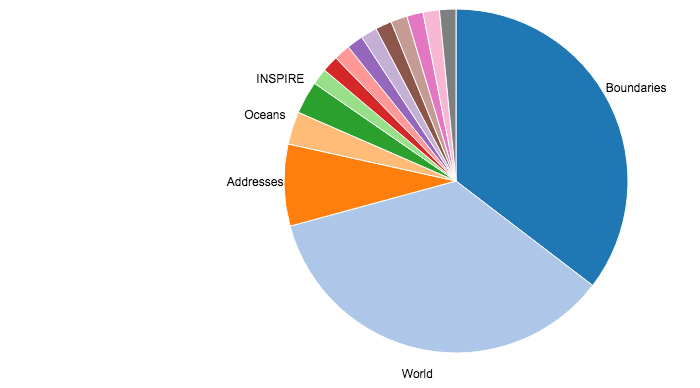

.. _home:

.. title:: Home

.. toctree::
    :maxdepth: 2
    :hidden:

    news.rst
    docs.rst
    downloads.rst
    community.rst
    gallery/gallery.rst
    acknowledgements/acknowledgements.rst

GeoNetwork is a catalog application to **manage spatially referenced resources**.
It provides powerful **metadata editing** and **search** functions as well as an
interactive web map viewer.
It is currently used in **numerous Spatial Data Infrastructure initiatives across the world**.

Features
========

Find & get information
----------------------

GeoNetwork provides an easy to use web interface to search geospatial data
across multiple catalogs. The search provides full-text search as well as
faceted search on keywords, resource types, organizations, scale, ... Users
can easily refine the search and quickly get to the records of interest.

GeoSpatial layers, but also services, maps or even non geographic datasets
can be described in the catalog. Easily navigate accross records and find
sources or services publishing a dataset.

Make your maps
--------------

The interactive map viewer based on `OpenLayers 3 <http://openlayers.org/>`_
provides access to OGC services (WMS, WMTS) and standards (KML, OWS). Connected
to the catalog, users can easily find new services, layers and even dynamic maps
to combine them together. User maps can be annotated and printed and shared
with others.

Publish & describe resources
----------------------------

Describe information using the online metadata editing tools. The metadata
editor support ISO19115/119/110 standards used for spatial resources and also
Dublin Core format usually used for opendata portals.

Based on user profiles (eg. reviewer, editor), a dashboard provides easy access
to their informations and tasks. Online editing of metadata is based on
a powerful template system and directories of information (eg. contacts, thesaurus).

The editor provides uploading of data, graphics, documents, pdf files and any
other content type. It supports among others:

* multilingual metadata editing,
* validation system,
* suggestion to improve metadata quality
* geopublication of layers to publish geodata layers in OGC services (eg. GeoServer)

Easy configuration
------------------

The administration console provides quick access to the system configuration.
Easily manage user and group accounts, classification systems
from the web interface and schedule metadata harvesting from many sources including:

* OGC-CSW 2.0.2 ISO Profile,
* OAI-PMH,
* Z39.50 protocols,
* Thredds,
* Webdav,
* Web Accessible Folders,
* ESRI GeoPortal
* Other GeoNetwork node.

Analyze information
-------------------

Monitoring and reporting tools provide summarized information about the content of
the catalog and statistics on the search. System maintainer can easily
access the system status.

More
====

API
---

GeoNetwork implements the following protocols:

* OGC CSW
* OAI-PMH
* OpenSearch
* Z39.50

and also provides its own API to interact with other systems and
a DCAT/RDF search service.

Customise & extend
------------------

With version 3, you can easily customise the appearance of your GeoNetwork
using Bootstrap themes.

GeoNetwork provides a plugin mechanism for creating your own metadata schema (
eg. `ISO19115-3 plugin <https://github.com/metadata101/iso19115-3.2018>`_).

OpenSource & standards
----------------------

GeoNetwork has been developed to connect spatial information communities and
their data using a modern architecture, which is at the same time powerful and low cost,
based on the principles of Free and Open Source Software (FOSS) and
International and Open Standards for services and protocols (a.o. from ISO/TC211 and OGC).

Support
=======

Community and OSGeo
-------------------

The GeoNetwork community has been expanding quickly over the last years.
The current release has been possible because of all those that contributed
to the project through code contributions, testing, bug reports and fixes as
well as many suggestions.
 
GeoNetwork is part of the Open Source Geospatial Foundation
(OSGeo, http://www.osgeo.org) software stack, providing software you can
trust tobe free, open and sustainable. Voluntary support is provided through
mailing lists, websites and online forums.

More: :doc:`community`

Professional Support
--------------------

Several companies also provide commercial support to help organizations
to implement, integrate and maintain the software. You can find them
in the `Service Provider directory <http://www.osgeo.org/search_profile>`_ on the
OSGeo website.
