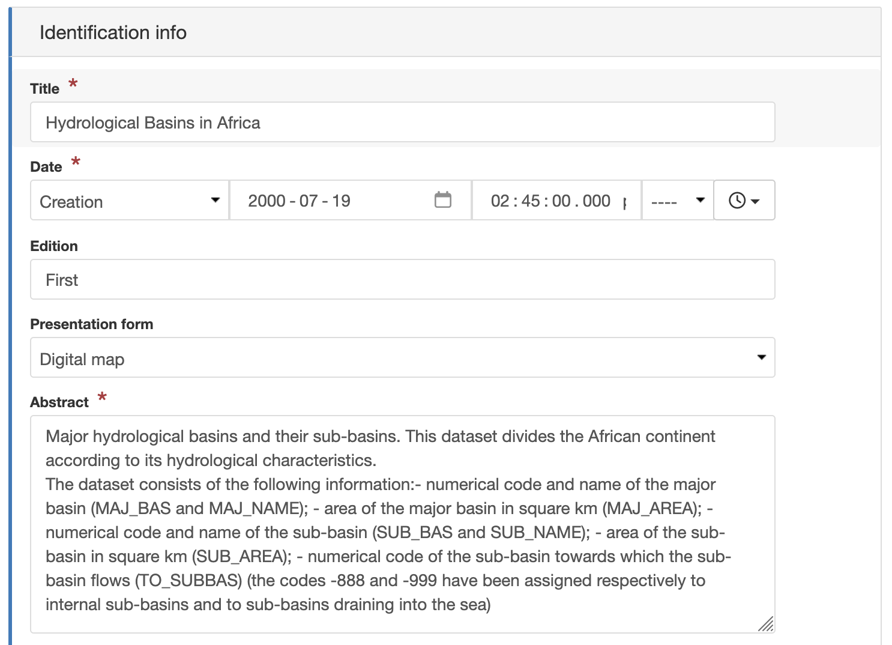
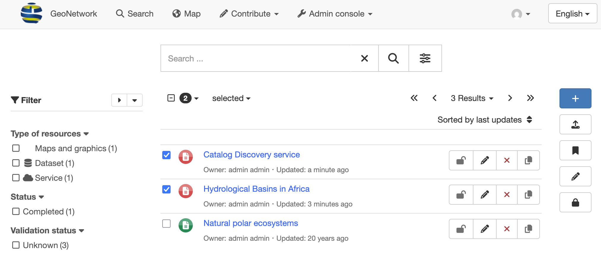
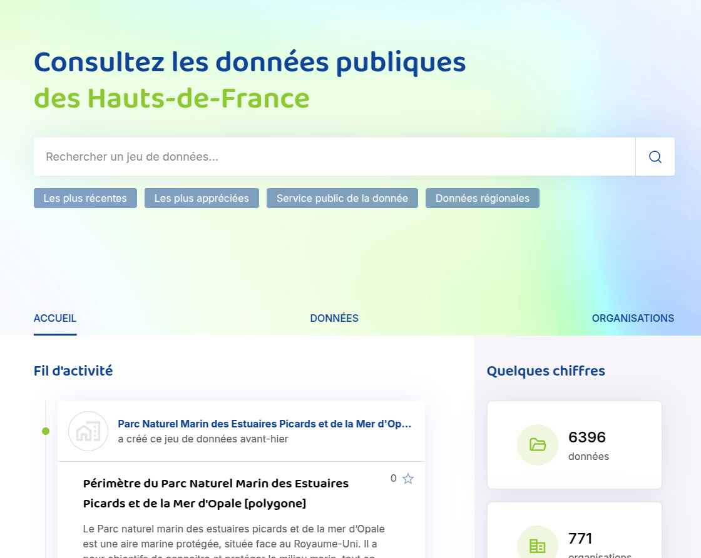
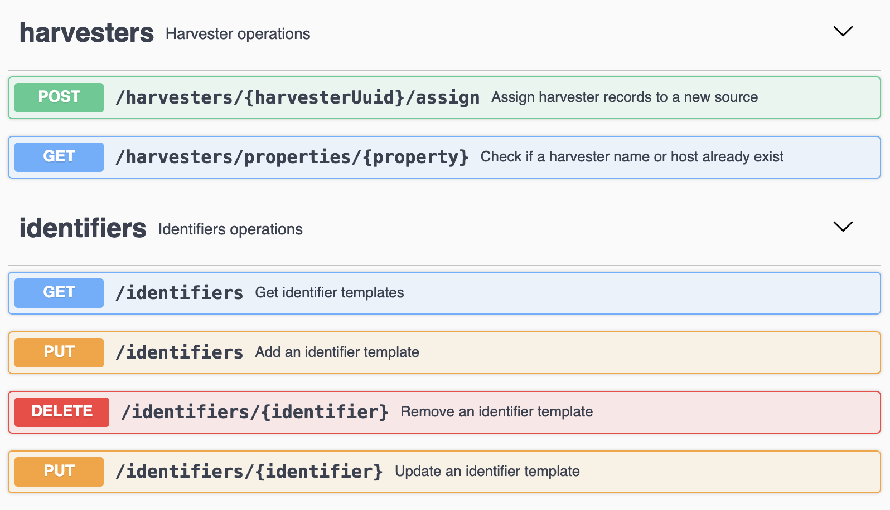

.. _home:

.. title:: Home

.. toctree::
    :maxdepth: 2
    :hidden:

    news.rst
    docs.rst
    downloads.rst
    community.rst
    usermeeting2020.rst
    gallery/gallery.rst
    acknowledgements/acknowledgements.rst

GeoNetwork is a catalog application to **share information** for **search and discovery**.
Contents are managed with a full set **metadata editing and review** tools backed by a publication workflow.

Built with love by the geopatial community, GeoNework has deep support for spatial information and includes an interactive web map viewer. 
GeoNetwork is a vital component of numerous **Spatial Data Infrastructure** initiatives world wide.

Find & retrieve information
===========================

GeoNetwork provides an easy to use web interface to search geospatial data
across multiple catalogs.

.. image:: gn-search.png
    :align: right
    :width: 400 px
    :alt: GeoNetwork v3 Search results

The search provides full-text search as well as
faceted search on keywords, resource types, organizations, scale, and more. 
Users can easily refine the search and quickly locate their records of interest.

GeoNetwork is a general purpose catalog for sharing information.
Easily navigate accross records and find sources, or services, publishing a dataset.

GeoNetwork is built with love by the geospatial community
with special attention to geographic datasets, layers, services, and maps.

Make your maps
===========================

Using the GeoNework catalog visitors can easily find new services, layers and produce dynamic maps
combining information from multiple services.

.. image:: gn-map.png
    :align: left
    :width: 400 px
    :alt: Map viewer
    
The `OpenLayers <http://openlayers.org/>`_ interactive map viewer provides access to open OGC services (WMS, WMTS),
and REST services (Feature Service, MapService), along with standards formats (KML, OWS).

User maps can be annotated and printed and shared
with others.

Describe resources
==================

Describe information using the online metadata editing tools. The metadata
editor support Dublin Core format used by opendata portals, and geospatial data and services with ISO-19115, service categories with ISO-19119, and data categories with ISO-19110 standards.

Online editing of records is based on a powerful template system, information lookup (eg. contacts),
and authoritative definitions (eg. thesaurus).

The editor allows records to store uploaded data, including graphics, documents, pdf files and any
other content type. It supports among others:

* multilingual metadata editing
* validation system
* suggestion to improve metadata quality
* geopublication of layers to publish geodata layers in OGC services (eg. GeoServer)

Publish resources
=================

Carefully manage the publication of information, using permissions share records with different groups. 
GeoNetwork supports multiple portals, allowing each group their own browsable catalog and web services.

The Editor dashboard provides easy access to information and tasks for reviewers and editors.

The full publication workflow allows changes to be reviewed and approved prior to publication.

Easy configuration
==================

The administration console provides quick access to the system configuration.
Easily manage user and group accounts, classification systems
from the web interface

.. image:: gn-admin.png
    :align: right
    :width: 400 px
    :alt: GeoNetwork admin console

Schedule metadata harvesting to synchronize records from many sources including:

* OGC-CSW 2.0.2 ISO Profile
* OGC WFS
* OAI-PMH
* Thredds
* SFTP and WebDAV
* Web Accessible Folders
* GeoPortal REST and ArcSDE
* Other GeoNetwork catalogs

Monitoring and reporting tools provide administrators insight into catalog contents and statistics on the search use. System maintainer can easily access the system status.

Customise & extend
==================

GeoNetwork provides a plugin mechanism for creating your own metadata schema (eg. `ISO19115-3 plugin <https://github.com/geonetwork/core-geonetwork/tree/main/schemas/iso19115-3.2018>`_).
Schemas can be `refined to match national and regional requirements <https://metadata101.org>`__, providing
validation and feedback directly within the metadata editor.

GeoNetwork offers built-in support to adjust colors and logos used for each
portal. Further customise the appearance of GeoNetwork using Bootstrap themes.

GeoNetwork plugins extend the application with optional functionality. The gn-datahub-integration plugin is used to provide a portal with a modern with GeoNetwork-UI web component facade. 

Additional plugins are provided for different cloud storage options (S3, CMIS, JCloud) for data directory and attachments.

API & web services
==================

GeoNetwork provides entry points for interacting with the catalog:

* Search service for fast and flexible record retrieval
* OGC Catalog Service for the Web (CSW) standards compliant search, retrieval, record management. 
* OGC API Records next generation REST / JSON standards presently under development
* GeoNetwork REST API working with GeoNetwork clients and external systems.

OpenSource & open standards
===========================

GeoNetwork has been developed to connect spatial information communities and
their data using a modern architecture, which is at the same time powerful and low cost,
based on the principles of Free and Open Source Software (FOSS) and
International and Open Standards for services and protocols from ISO/TC211 and OGC.

Community and OSGeo
===================

GeoNetwork releases are made possible by everyone supporting the project
through code contributions, testing, bug reports, fixes and financial sponsorship.
 
GeoNetwork is part of the `Open Source Geospatial Foundation <https://www.osgeo.org>`__
(OSGeo) software foundation, providing software you can
trust to be free, open and sustainable.

Community support is provided through `documentation website <https://docs.geonetwork-opensource.org/>`__, and `online forum <https://discourse.osgeo.org/c/geonetwork/user/54>`__.

More: :doc:`community`

Professional Support
====================

Commercial support is available to help organizations implement, integrate and maintain the software.
You can find them in the `Service Provider directory <https://www.osgeo.org/service-providers/?p=geonetwork>`_ on the
OSGeo website.
