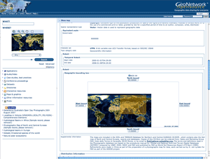

.. _news:

News
====

GeoNetwork opensource v2.8.0 released
-------------------------------------

Date: 22 February 2013

We're pleased to announce the release v2.8.0 of GeoNetwork opensource. This is a major release that adds a lot of new functionality to the software. 

:doc:`downloads`

Here's a non-exhaustive list of `new features <http://geonetwork-opensource.org/manuals/2.8.0/eng/users/quickstartguide/newfeatures/index.html>`_.

GeoNetwork opensource v2.6.4 released
-------------------------------------

Date: 17 May 2011

We're pleased to announce the maintenance release v2.6.4 of GeoNetwork opensource. This is a minor release fixing a range of issues and adding a number of small improvements to the software. 

:doc:`downloads`

Here is a list of fixes and changes:

Changes
```````
- #456 Catalan translation, thanks Montserrat Marco Sabaté.
- #462: Load wms in map viewer for service metadata
- #463: Update Web Map Viewer OpenLayers to 2.10
- CSW Server configuration: use textarea for abstract and increase field size
  (label) in CswServerCapabilitiesInfo table
- Set WMC panel layout
- Added verbose protocol list for online resources (metadata editor)
- Turkish translation, thanks to the Turkish Kadastro (TKGM)
- #491: Custom ElementSet in CSW 2.0.2
- INSPIRE schematron fixes integrated from trunk
- CSW INSPIRE capabilities document updated to 1.0 xsd (scenario 2). Default
  values in capabilities_inspire.xml for TemporalReference, MetadataDate,
  SpatialDataServiceType, etc require user customization for his catalog

Bug fixes
`````````
- #299: Catch all empty elements with gco:nilReason=missing attribute to avoid
  large blank spaces in metadata views.
- #395: Use proxy configuration for built in proxy in GeoNetwork. Thanks schaubr
  for patch
- Fix for ticket #435 - thanks to Craig Jones, IMOS/eMii and Andrew Walsh, AODN
- #467: Search by abstract in Dublin Core doesn't find results
- #473: Left-column disappearing. Disabled scroll effect
- #476: Improvements to GeoNetworkAnalyzer
- Restore ending wildcard. Related to #476.
- Fix #478. Thanks Justin Rowles
- Fix resumptionToken handling in OAI-PMH harvester: backporting #7189
- OAIPHM havester fix for Until date, the From date value was used instead
- #492 : CSW 2.0.2 ElementName processing broken
- #503 Security hole in metadata insert
- Metadata insert, fixes when validation option is selected:
  1) validate xsd and schematron, both in copy&paste and file upload options
  2) show schematron report with errors (if any)
- Fix for save template display order

GeoNetwork opensource v2.6.3 released
-------------------------------------

Date: 18 January 2011

We're pleased to announce the maintenance release v2.6.3 of GeoNetwork opensource. This is a minor release fixing a range of issues and adding small improvements to the software. 

Here is a list of fixes and changes:

Bug fixes
`````````
- #422 : 26x numeric fields range query bug
- #376 : Configurable stopwords fixes
- Tokenize responsiblePartyRole field to allow case insensitive searches
- Unification of INSPIRE GEMET thesaurus path for schematron rules and indexing of INSPIRE themes
- xml.user.metadata service changed to use Lucene instead of SQL

GeoNetwork opensource v2.6.2 released
-------------------------------------

Date: 24 December 2010

We're happy to announce the release of GeoNetwork v2.6.2. This is a minor release that fixes a number of bugs and adds a number of great new improvements listed below.

A security hole was discovered that is fixed in this release. We strongly advise you to upgrade your existing implementations of GeoNetwork to this version! 

Here is a list of fixes and changes:

Bug fixes
`````````
- Be sure id is an integer when creating SQL query. Thanks Pierre Mauduit
- Fix download with special character
- Protect code in getMetadataFromIndex if createDate or changeDate are null (for example, if created/harvested invalid metadata without this fields)
- Removed Download link (doesn't work within release documentation unless generic)
- Use permanent redirect instead of temporal redirect to avoid some issues when running with Apache proxy
- XSL processor configuration
- Fix #387 : GN vulnerable to other application's TransformerFactory
- Fix #397 : Thesaurus name after adding keyword
- Fix #398 : INSPIRE keywords not multilingual
- Fix #399 : Map in editor does not work correctly
- Fix #400 : Security hole in GeoNetwork -- search for owner
- Fix #413 : Fix typo in SQL scripts
- Fix #415 : Simple numeric indexing

Changes
```````
- 2.6.x documentation updates
- Added documentation for ArcSDE harvester
- ArcSDE harvester documentation update
- GN logo points to http://geonetwork-opensource.org
- Improved documentation
- Improved pdf search print layout
- Removed InterMap log removal
- Small GUI improvements in search form
- Update version number in installer
- Updated Russian language files (thanks Irina Romanova)
- Updated documentation license
- Updated navigation for documentation
- Updated sql files for 2.6.2
- #376 : Configurable stopwords
- #391 Metadata Notifications to Remote Targets
- #407 : Option to discard invalid harvested metadata
- #410 : My Metadata function
- #411 : INSPIRE - support for CSW LANGUAGE parameter
- #412 : Add isPublishedToAll to geonet:info

GeoNetwork opensource v2.6.1 released
-------------------------------------

Date: 18 November 2010

We're pleased to announce the maintenance release v2.6.1 of GeoNetwork opensource. This is a minor release fixing a range of issues and adding small improvements to the software. 

Here is a list of fixes and changes:

Bug fixes
`````````

- Exclude some substitutions which prevent the vertical extent element from being fully expanded
- Fix migration scripts from 2.4.3 to 2.6.0
- Fix search using INSPIRE annex
- Typo fix for German language
- Added support for sqlserver database. Thanks to Mikael Elmquist for provide sql files
- Add in xslt converters for DIF to ISO and Thredds
- Missing xslt to convert netcdf CDM coords to ISO keywords
- Fix harvesting a OAI set whose name contains a "-". Thanks Tim Proescholdt
- Fix #335: Max number of children displayed in relation panel. Added from and to parameters to allow paging in related records if needed
- Fix #339: Wildcard search broken
- Fix #337: Metadata indexing uses old INSPIRE setting
- Fix #343: CSW / iso19110 / exception when requesting ISO19139 output
- Fix #344: bad schema error when using XSL on import. Thanks murrayking
- Fix #345: Changed postgres driver version to be compatible with Java 1.5
- Fix #346: Javascript error when setting "singleTile: true" for a WMS layers in Map viewer
- Fix #347: Fix thesaurus directory removed by maven
- Fix #348: ArcSDE Harvester. Javascript error accessing config panel
- Fix #354: XSL error message in WMC to Iso19139 transformation
- Fix #357: Use geometry parameter in GUI search for bounding boxes, instead of lucene bbox fields. Fixed also Disjoint spatial filter
- Fix #364: CSW queryables, added support for INSPIRE ResponsiblePartyRole and fix for ResourceIdentifier
- Fix #365: Allow to configure LDAP uid attribute name
- Fix #366: Add contextual label translation allowing to use full xpath for elements in metadata editor
- Fix #367: Not possible to search on Subject queryable for a value that includes spaces
- Fix #371: Tooltips in System Configuration have disappeared

Changes
```````

- Added support for OpenLayers Map config options in map viewer
- Service to retrieve the metadata owned by a user
- Use redirect for login and logout services to show in browser address bar the url of main page, after login/logout

GeoNetwork opensource v2.6.0 released
-------------------------------------

Date: 1 October 2010

We're proud to announce the release of GeoNetwork opensource v2.6.0. This is a major release for the project that provides great new functionality, helping all those that need to publish their geographic data and services with standardized metadata.


	
This release includes the following new or improved functionality:

- Performance improvements on search and indexing
- INSPIRE Search panel and metadata view
- New embedded Web Map Viewer based on OpenLayers
- Multilingual metadata display and editing support for the ISO19115/19119/19110 metadata standards (encoding based on ISO19139)
- Keywords and Coordinate Reference System selection panels
- Advanced data and metadata export
- Metadata relations management (Parent/child metadata, related service metadata, related feature catalogues)
- Advanced schema and schematron validation of metadata with reporting improvements
- Visual warnings in the metadata editor
and many more...
 
You can download the software from https://sourceforge.net/projects/geonetwork/files/GeoNetwork_opensource/v2.6.0/

Thanks and congratulations to the all community members! 

Jeroen Ticheler

